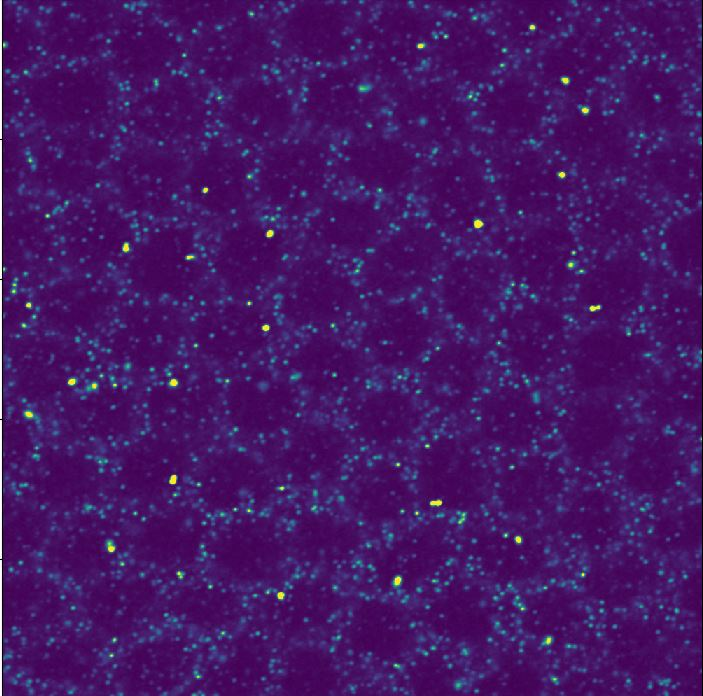
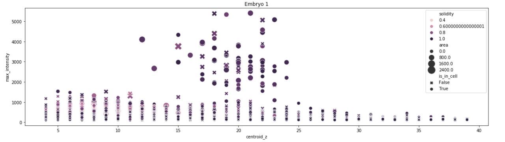
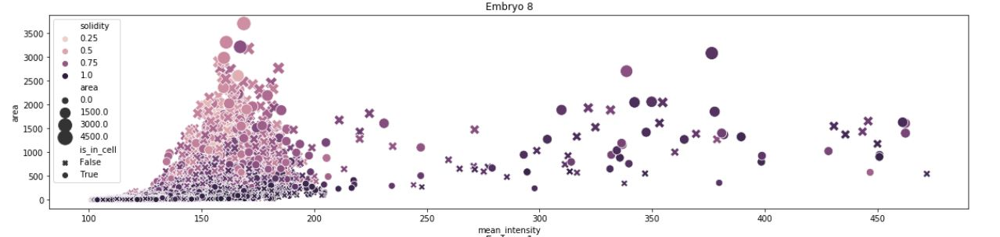
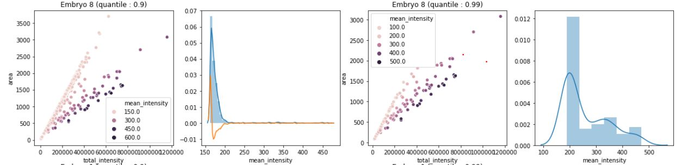
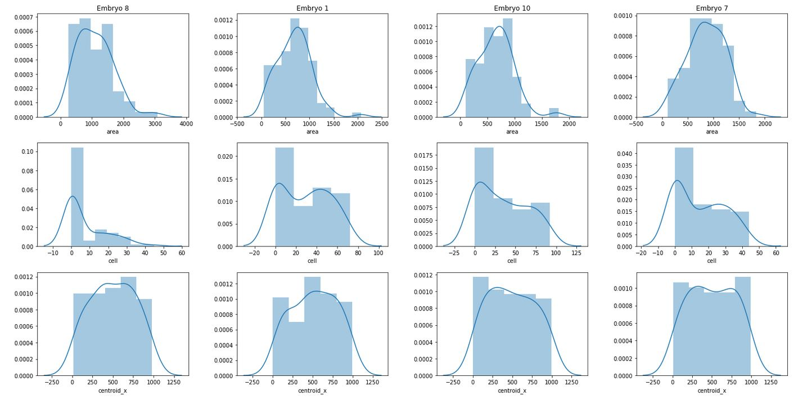
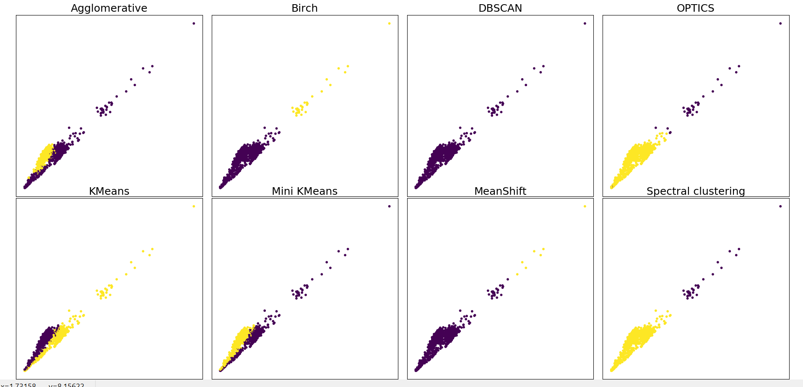

# Molecule classification

This project aims to detect automatically molecule and transcriptions site involved in the first step of developpement of drosophilia embryo.
Such information can be extracted from microscop images such as this one:

This package implements several tools requested to achieve this classification:
- Image filtering and scaling
- Region extraction
- Blob detection
- Contours detection
- 3D region aggregation
- Region features extraction
- Unsupervised classification benchmarker
- File manager and viewer
- Performance monitoring

A standard pipeline has been implemented in demo.py 

### Exemples
#### Region detection
Region detection performed on cells.

#### Cell contour detection
This detection is used as feature of classification algorithm. Region are tagged regarding the cell they are embedded in or not. 

#### Various data exploration prior to classification
Region intensity exploration along the z axis

Intensity / area ratio

Distribution filtering. This part enables classification of Transcription site

Features distribution analysis

#### Unsupervised classification benchmark
A benchmark tool has been implemented to identify which classification algorithm presents the best results.
The following classification was handled on the raw features (prior to distribution filtering)

 

  