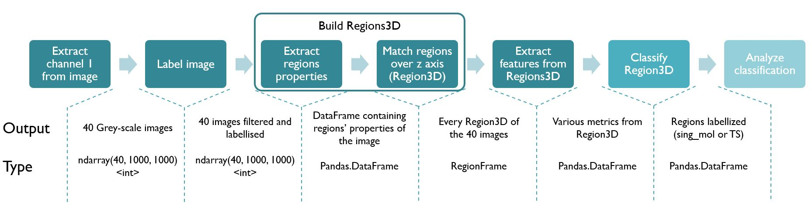

# Molecule classification

This project aims to detect automatically molecule and transcriptions site involved in the first step of developpement of drosophilia embryo.
Such information can be extracted from microscop images such as this one:

This package implements several tools requested to achieve this classification:
- Image filtering and scaling
- Region extraction
- Blob detection
- Contours detection
- 3D region aggregation
- Region features extraction
- Unsupervised classification benchmarker
- File manager and viewer
- Performance monitoring

A standard pipeline has been implemented in demo.py 

### Exemples
#### Region detection

#### Cell contour detection

  